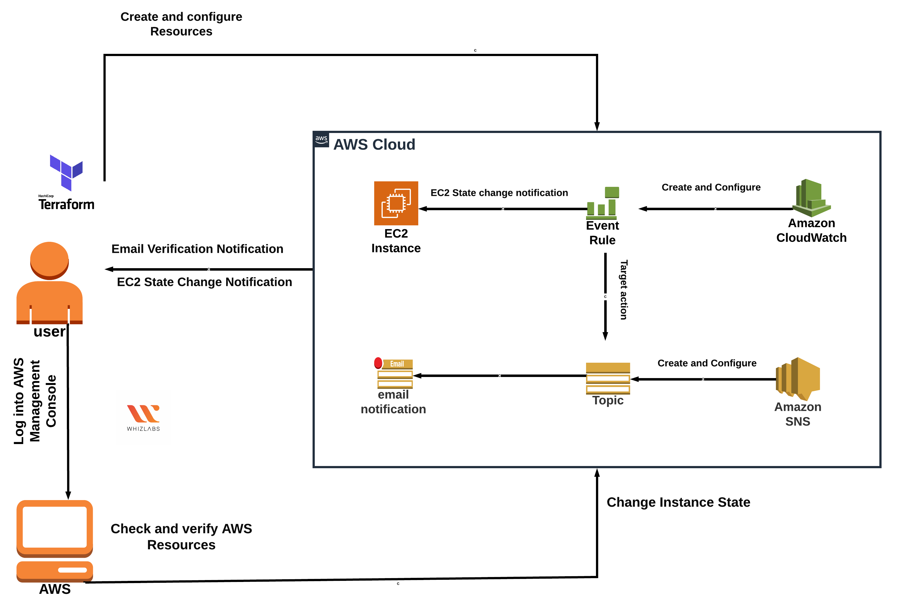

# Create-an-EventBridge-Rule-to-get-notified-on-EC2-Instance-state-change-using-Terraform

Architecture Diagram :

> #### Terraform commands 
>
> - terraform init 
> - terraform plan
> - terraform apply
> - terraform destroy